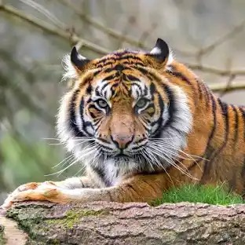
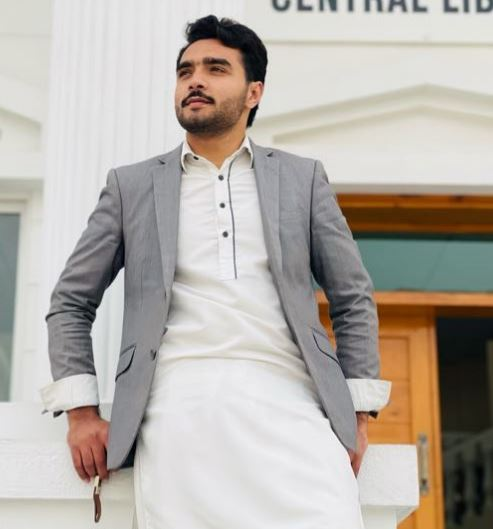

# Image Stitching for Panorama Generation

## Screenshots

### Feature Matching Visualization

#### Low Match Percentage - Different Subjects (2.40%)

*Feature matching between unrelated images (person and tiger) showing poor correspondence*

#### High Match Percentage - Same Subject (100.00%)

*Feature matching between similar images showing excellent correspondence*

## Overview

This project provides a comprehensive solution for creating panoramic images from multiple overlapping photographs. It leverages advanced computer vision techniques to detect features, match corresponding points across images, compute geometric transformations, and seamlessly blend the images together.

### Key Features

- **Intelligent Image Analysis**: Automatically analyzes and optimizes image parameters
- **Advanced Feature Detection**: Scale-Invariant Feature Transform (SIFT) with adaptive parameters
- **Robust Feature Matching**: FLANN-based matching with ratio test for accuracy
- **Match Quality Metrics**: Displays percentage of matched features for quality assessment
- **Multi-method Blending**: Choose between average and multi-band blending techniques
- **Interactive UI**: User-friendly Gradio interface with real-time processing
- **Visualization Tools**: Displays feature matches for better understanding and debugging
- **Parameter Customization**: Fine-tune brightness, contrast, and blur for optimal results
- **Command-line Flexibility**: Run with custom ports, hosts, and sharing options

## Demonstration

### Feature Matching Quality Assessment

The system evaluates the quality of matches between images to predict panorama success:

#### Low Match Percentage (Different Images)

*Match percentage: 2.40% (13 of 542 possible matches) - Poor candidates for stitching*

#### High Match Percentage (Similar Images)

*Match percentage: 100.00% (659 of 659 possible matches) - Excellent candidates for stitching*

This match percentage feature helps users quickly determine if their images are suitable for creating panoramas.

## Installation

### Prerequisites

- Python 3.7 or later
- Pip package manager

### Option 1: Quick Setup

```bash
# Clone the repository
git clone https://github.com/YourUsername/image-stitching-panorama.git
cd image-stitching-panorama

# Install dependencies
pip install -r requirements.txt

# Run the application
python app.py
```

### Option 2: Development Installation

```bash
# Clone the repository
git clone https://github.com/YourUsername/image-stitching-panorama.git
cd image-stitching-panorama

# Install in development mode
pip install -e .

# Run the application
python app.py
```

## Usage

### Basic Usage

1. Start the application:
```bash
python app.py
```

2. Open your web browser and navigate to: http://127.0.0.1:7860

3. Use the interface to:
   - Upload two images with overlapping regions
   - Adjust processing parameters if needed
   - Click "Generate Panorama" to create the stitched image
   - Save the result to your local machine

### Advanced Command-line Options

The application supports various command-line arguments:

```bash
python app.py --port 8080 --host 0.0.0.0 --share --debug
```

Available options:
- `--port`: Specify the port number (default: 7860)
- `--host`: Set the host IP address (default: 127.0.0.1)
- `--share`: Create a public link for sharing the interface
- `--debug`: Run in debug mode for additional logging
- `--server-name`: Specify a custom server name

### Preprocessing Parameters

- **Brightness Adjustment** (-50 to 50): Enhances dark or bright images
- **Contrast Adjustment** (0.5 to 2.0): Improves feature detection in low-contrast images
- **Blur Amount** (0 to 5): Reduces noise in images with excessive detail
- **Blending Method**: 
  - Average: Simple 50/50 blend in overlapping regions
  - Multi-band: Distance-weighted blending for smoother transitions

### Match Quality Assessment

The system now provides a match percentage that indicates the quality of feature matching between images:

```
Match percentage: 23.45% (125 of 533 possible matches)
```

This metric helps in understanding:
- How well the images align
- The strength of the correspondence between images
- The reliability of the generated panorama

A higher percentage typically indicates better alignment and more reliable stitching.

## Technical Details

### Pipeline Architecture

1. **Image Analysis**: Analyzes brightness, contrast, and sharpness characteristics
2. **Parameter Optimization**: Automatically adjusts processing parameters based on image properties
3. **Feature Detection**: Identifies distinctive keypoints using SIFT algorithm
4. **Feature Matching**: Matches keypoints between images using FLANN-based matching
5. **Match Filtering**: Applies ratio test to filter high-quality matches
6. **Homography Estimation**: Calculates geometric transformation using RANSAC
7. **Image Warping**: Transforms and aligns images according to the computed homography
8. **Image Blending**: Seamlessly combines images using selected blending method

### Adaptive Processing

The system adapts to various image characteristics:
- For dark images: Increases brightness automatically
- For low-contrast images: Enhances contrast for better feature detection
- For noisy or excessively detailed images: Applies appropriate blur

### Error Handling

Comprehensive error handling for common issues:
- Insufficient features detected
- Poor or insufficient matches
- Invalid homography matrices
- Processing exceptions with informative error messages

## Examples

| Scene Type | Best Parameters | Expected Results |
|------------|-----------------|------------------|
| Landscapes | Default settings | Excellent alignment |
| Architecture | Higher contrast | Good alignment with straight lines |
| Low-light | Increased brightness | Improved feature detection |
| Busy scenes | Light blur | Reduced noise, better matching |

## Contributing

Contributions are welcome! Please feel free to submit a Pull Request.

1. Fork the repository
2. Create your feature branch (`git checkout -b feature/amazing-feature`)
3. Commit your changes (`git commit -m 'Add some amazing feature'`)
4. Push to the branch (`git push origin feature/amazing-feature`)
5. Open a Pull Request

## License

This project is licensed under the MIT License - see the [LICENSE](LICENSE) file for details.

## Acknowledgments

- OpenCV library for computer vision algorithms
- Gradio for the interactive interface
- The computer vision community for research and algorithms 