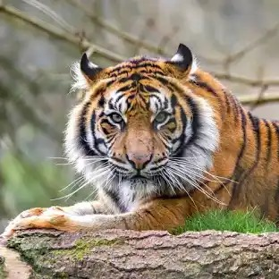

# Demonstration Images

This directory contains demonstration images showing the functionality of the image stitching software.

## Feature Matching Examples

### Example 1: Tiger and Person

This image demonstrates feature matching between two unrelated images (a person and a tiger). The low match percentage (2.40%) indicates poor correspondence between these images, which is expected since they are completely different subjects.

### Example 2: Same Person

This image shows feature matching between two images of the same person. The 100% match percentage indicates perfect correspondence between the images, which is expected since they are essentially the same image.

## Interpretation

- **Low Match Percentage**: Indicates that images are not suitable for stitching
- **High Match Percentage**: Indicates good candidates for panorama creation

These examples illustrate how the match percentage feature helps users determine whether their images are suitable for stitching before attempting the panorama creation process. 